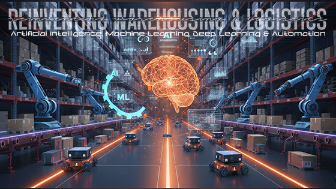
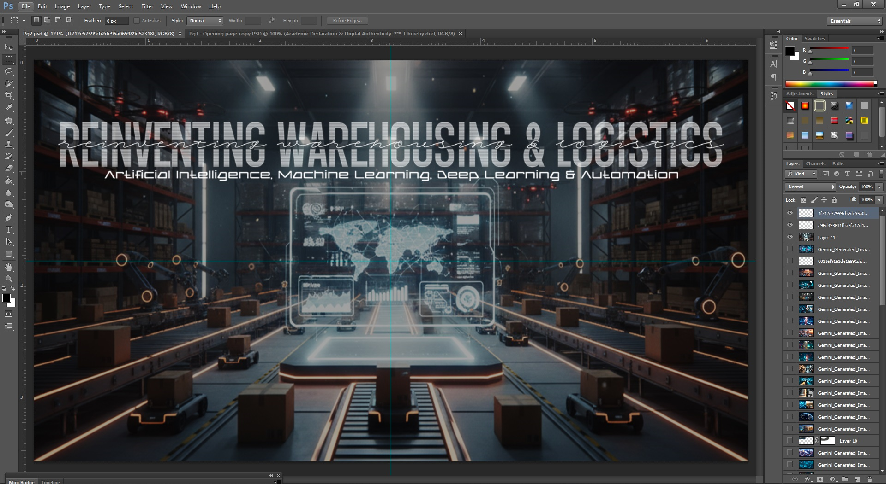

# 🎬 Reinventing Warehousing & Logistics
### *with Artificial Intelligence, Machine Learning, Deep Learning & Automation*
```
Data Science for Business Masterclass - eLearning.lk
Final Project Video Essay
```

# Link to the video

https://youtu.be/yzTidCVrohw?si=2tjfZo7egWSjsk-T


## 📌 Project Overview
This repository documents the complete process of creating my final **video essay project** for the *Data Science for Business Master Class*.  

**Topic:**  
Analyzing the impact of **Artificial Intelligence, Machine Learning, Deep Learning, and Automation** on warehousing and logistics.

The project covers:  
- Introduction & history of AI/ML/DL in warehousing & logistics  
- Transformation of warehouses through automation  
- Global adoption patterns & digital divides  
- Ethical concerns (data privacy, algorithmic bias, employment)  
- Strategic recommendations for businesses  
- Vision for the future of supply chain intelligence  


## 📑 Assignment Outline
> From the official task brief:  
- Introduce the chosen technology and its applications  
- Analyze business impact (benefits & challenges)  
- Discuss ethical implications (privacy, bias, jobs)  
- Provide strategic recommendations for adoption  
- Final submission: **8–12 min MP4 video essay** with academic declaration

## 📝 Script
- The narration script was developed iteratively:  
  1. Initial draft generated with **Perplexity**  
  2. Refined for voice-over flow using **ChatGPT**  
  3. Final polish applied in **MS Word**
  4. Storyboard created with **MS Powerpoint**  

📂 Script files can be found under [`02_Script/`](./02_Script)  

## 🛠️ Tools & Services Used
- **Ideation & Writing**: Perplexity, ChatGPT, Claude, Grok, Gemini MS Word  
- **Storyboard**: MS PowerPoint  
- **AI Image generation**: Google Gemini - Nano Banana, Artflow.ai, fontmeme.com  
- **Image edit**: Adobe Photoshop CS6
- **Audio**: Voice narration (raw + edited), soundtracks  
  - NotebookLLM
  - 🎵 *Reminiscence (회상)* by Chiro.mp3  
  - 🎵 *Tech Corporate Music* – musicforvideo.net  
- **Video Editing**: CapCut 4.8 (final assembly)  
- **Version Control**: Git & GitHub, Visual Studio Code

## 📂 Folder Structure
```
AI_ML_DL_&_Automation_in_WarehoData_Science_Masterclass_Final_Project_Video_Essay/
│
├── 1_Assignment_outline/
│   └── Assignmet outline.docx
│
├── 2_Script/
│   ├── 1_Drafts/
|   |   └── Draft Script.docx
│   ├── 2_Final_Script/         
│   |   └── Final Script - Reinventing Warehousing and Logistics.docx       
│   └── 3_Storyboard/
│       └── Storyboard.pdf
│
├── 3_Diagrams/
│   └── 1_Mindmap/          
│        └── Mind Map.png
│
├── 4_Audio/
│   └── Narration/
│       └── Reinventing_Warehousing_&_Logistics.MP3          
│
├── 5_Image_generation_&_editing/      
│
├── 6_Final_Product/
│   ├── Reinventing Warehousing & Logistics.mp4
│   └── Reinventing Warehousing & Logistics-Cover.jpg
│   
├── CapCut - Video Editing Layout.jpg
├── Photoshop - Image Editing Layout.jpg
└── README.md
├── .gitignore
└── LICENSE.md
```

## 🖼️ Screenshots

## Photoshop (Image Retouching & Edits)


## CapCut (Final Video Editing)
 
